# 💖 SexyLove


**"Security through Aesthetics. Intimacy through Obfuscation."**

SexyLove is an ultra-premium personal companion application defined by a **Dual-Layer Cognitive Architecture**. It presents a "Superficial" Public Facade to the world while concealing a deeply encrypted "Hidden Vault" accessible only to those who know the secret gesture.

---

## 🏛️ Architectural Philosophy

SexyLove operates on a zero-knowledge, obfuscated-first principle. It doesn't just encrypt your data; it hides the very existence of its secure layer.

```mermaid
graph TD
    A[Public Facade: Notes & Utilities] -->|3 Rapid Clicks on Title| B(Auth Gateway)
    B -->|Access Code + PIN| C[Hidden Vault]
    C --> D[Geografía del Deseo]
    C --> E[Multi-Identity Profiles]
    C --> F[Intimate Fantasies]

    subgraph "The Mirror Effect"
    A
    end

    subgraph "The Subterranean Layer"
    C
    D
    E
    F
    end

    style A fill:#f9f,stroke:#333,stroke-width:2px
    style C fill:#69f,stroke:#333,stroke-width:4px
```



---

## ✨ Feature Matrix

| **The Superficial Layer** (Notes)                              | **The Subterranean Layer** (Vault)                             |
| :------------------------------------------------------------- | :------------------------------------------------------------- |
| **Block-Based Editor**: Premium notes with folder PIN locking. | **Geografía del Deseo**: Map-based memory visualization.       |
| **Glassmorphic UI**: High-end animations (GSAP/Framer).        | **Eternity Sync**: Conflict-resilient offline synchronization. |
| **Chameleon Alias**: Native dynamic app icon switching.        | **AES-256 Encryption**: Zero-knowledge client-side security.   |

---

## 📚 Documentation Hub

We maintain two distinct layers of documentation to ensure both strategic vision and technical excellence.

### 🏛️ Agent OS Core (Strategic Mastery)

Living specifications for the long-term evolution of the project.

- **[🗺️ Atomic Specifications Index](agent-os/specs/index.md)**: The technical blueprint.
- **[🎯 Product Mission](agent-os/product/mission.md)**: The "Why" and the "Who".
- **[🛤️ Roadmap](agent-os/product/roadmap.md)**: Detailed milestones and vision.
- **[💻 Tech Stack](agent-os/product/tech-stack.md)**: Exhaustive architectural choices.

### 📖 Practical Guides

Standard manuals for developers and contributors.

- **[🚀 Getting Started](docs/GETTING_STARTED.md)**: Installation and local setup.
- **[🏗️ Architecture](docs/ARCHITECTURE.md)**: Dev-centric project structure.
- **[✨ Features](docs/FEATURES.md)**: Functional overview.
- **[🚀 Deployment](docs/DEPLOYMENT.md)**: Web and Android build guides.
- **[🤝 Contributing](docs/CONTRIBUTING.md)**: Code style and standards.

### 🔍 Technical Reference

- **[API Documentation Index](docs/api/index.html)**: Auto-generated TypeDoc reference (Open in Browser).

---

## 🛠️ The Stack

| Frontend                         | Backend                         | Native / Mobile              |
| :------------------------------- | :------------------------------ | :--------------------------- |
| **React 19** + **Vite**          | **Supabase** (Auth/DB/Realtime) | **Capacitor 7**              |
| **Tailwind CSS** + **Shadcn/ui** | **PostgreSQL**                  | **Android Studio** (Aliases) |
| **GSAP** + **Framer Motion**     | **IndexedDB** (Offline Cache)   | **MapLibre GL** (Maps)       |

---

## ⚡ Quick Start

Ensure you have [pnpm](https://pnpm.io/) installed.

```bash
# Clone and install
git clone https://github.com/milov-ai/sexylove.git
cd sexylove
pnpm install

# Run in Development mode
pnpm run dev
```

For environment configuration (Supabase keys), please refer to the **[Getting Started Guide](docs/GETTING_STARTED.md)**.

---

## 🔒 Security Disclaimer

SexyLove uses industry-standard AES-256 encryption. However, security is a shared responsibility. Ensure you use a strong Access Code and never share your Vault PIN.

© 2025 **Milov Ai**. All rights reserved. Part of the LinguaFlow ecosystem.
